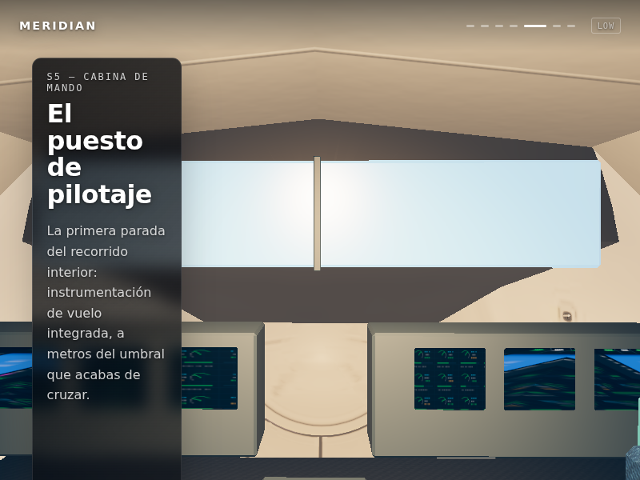
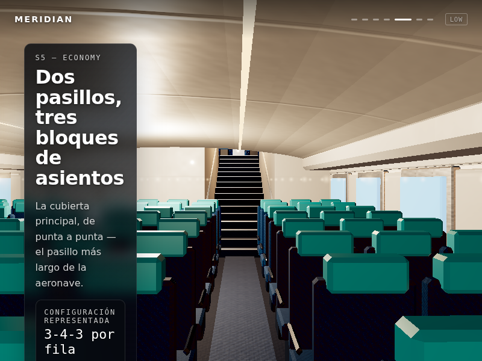
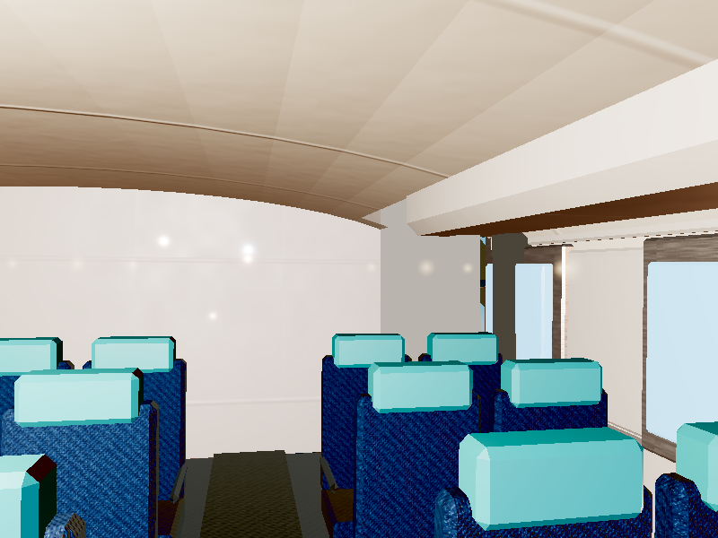

# Evidencia — fases 0–2

Base remota: `b528527a4d187adc0a621e4f462720d8650ca06f`.

| Comprobación | Resultado |
|---|---|
| [Pruebas](tests.txt) | 46/46 |
| [Build](build.txt) | PASS; chunk grande pendiente |
| [Geometría](geometry-report.json) | 3.751 muestras; cero colisiones en BLEND/GLB |
| [Anclas](registration-report.json) | Cinco anclas bajo matriz canónica: PASS |
| [Asset](asset-report.txt) | 266 asientos, siete lotes espaciales, 69.129 triángulos |
| [HDRI](hdri.txt) | PASS |
| [Locks](scroll-contract.json) | Rueda/teclado/scrollbar; motivos independientes; retorno programático y liberación final |

[Error de descarga](error-report.json): PASS, objetivo 0,7 conservado, hold
0,4092 y retorno al inicio 0,00097. Abort/console errors del asset son
intencionales en esta prueba.

[CI sobre el commit de implementación](https://github.com/berrizjuane-collab/boeing-747/actions/runs/35467717659): comprobaciones estáticas aprobadas;
Low/High/tour en curso al escribir este checkpoint. [Despliegue](https://github.com/berrizjuane-collab/boeing-747/actions/runs/35467717605) aprobado.

[Siete planos Low](low-report.json): PASS, 800×600, tier Low desde el inicio,
reloj fijo 12 s, frames convergentes y zona DOM correcta. Hero tiene 0,739 %
de blancos recortados (<2 %); contraste estimado de ficha 19,28 (≥4,5).
Se guardan tres imágenes representativas en este índice; el informe contiene
los siete estados. CI produce los conjuntos completos con/sin overlays.

[Diez ciclos producción](production-cycles-report.json): PASS, 119 geometrías /
41 texturas / 99 programas en cada ciclo tras calentamiento, igual que StrictMode.
Ambas pruebas de recursos usan movimiento reducido. No sustituyen el tour
con reloj real ni la aceptación visual High. Las
pruebas numéricas no equivalen a aprobación visual del producto. Baseline
previo completo y matriz High 1440×900 pendientes. Véase `progress6.md`.

[Descarga retenida](slow-report.json): PASS, hold 0,4093 y reanudación 0,6993.
[Diez ciclos StrictMode](strict-cycles-report.json): PASS, tras warm-up todos
los ciclos tienen 119 geometrías / 41 texturas / 99 programas. Se usa movimiento
reducido y viewport 400×300 para aislar montaje/memoria; no es una prueba de
suavidad ni de rendimiento físico. El movimiento real se prueba en el tour.

Capturas Low 800×600, reloj 12 s y progreso convergente. Las capturas de texto
preceden una corrección editorial: se elimina la afirmación «de punta a punta»
para este tramo representativo. Geometría/cámara son las mismas. Los materiales
y la composición final siguen pendientes; estas imágenes documentan estructura.
